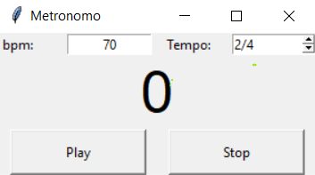

# Metronomo-v1
Represnetacion de un metronomo en python

# Instalacion
 - Version minima de python - 3.5
 - Paquetes 
    - `tkinter`
    - `winsound`
 - Correr `> python metronomo-v1.py`

# Intefaz de usuario

## Referencias
### winsound
 - https://docs.python.org/3/library/winsound.html
 - https://www.geeksforgeeks.org/python-winsound-module/

### tkenter
 - https://docs.python.org/3/library/tkinter.html
 - https://www.tutorialspoint.com/python/python_gui_programming.htm

